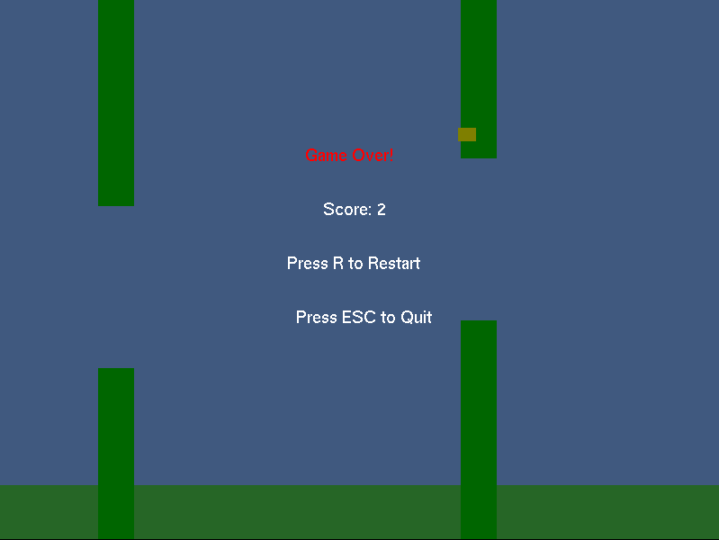
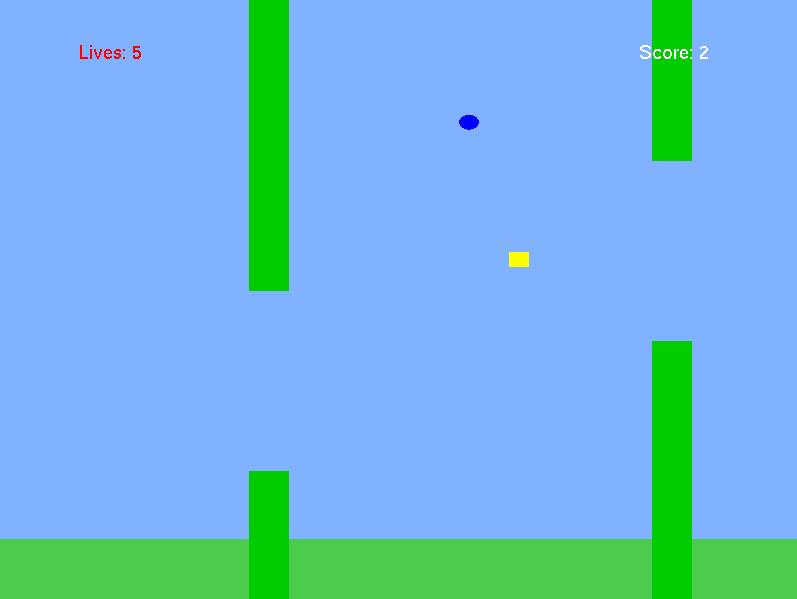
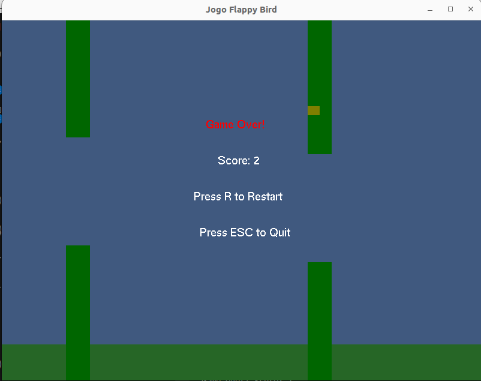
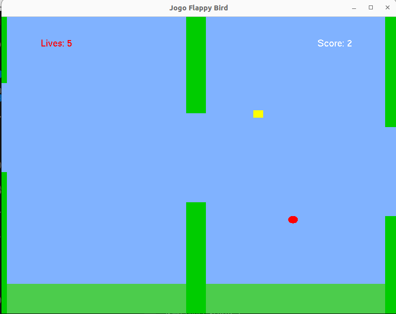

# Flappy Bird com OpenGL

Implementação do jogo Flappy Bird usando PyOpenGL para a disciplina de Computação Gráfica.

# Screenshots







## Requisitos


## Bibliotecas permitidas
- PyOpenGL_accelerate
- glfw
- Pillow (PIL)
- time
- numpy
- random

## Critérios de avaliação
- Fazer o personagem voar apertando a tecla ESPAÇO: 1.0 pontos
- Fazer os obstáculos e personagem se movimentarem: 1.0 pontos
- Realizar o tratamento de colisão: 1.0 pontos
- Contador de quantos obstáculos já passou: 1.0 pontos
- Exibir um contador de vidas, o jogo só finaliza quando termina o número de vidas: 1.0 pontos
- Criar objetos que aparecem aleatoriamente no jogo, pode ser vidas, alternador de velocidade, etc: 1.0 ponto
- A entrega do trabalho deverá ser feita enviando os arquivos do projeto no ambiente virtual e compartilhando um link do github que conste todo o código fonte, uma explicação do projeto e algumas telas do jogo: 1+.0 ponto
- Apresentação do trabalho: 3.0 pontos


## Funcionalidades

- Personagem que voa com a tecla ESPAÇO
- Obstáculos em movimento
- Tratamento de colisões
- Contador de obstáculos ultrapassados
- Sistema de vidas
- Itens coletáveis aleatórios

## Como executar

1. Ter Python instalado.

2. Instale as dependências:
```bash
sudo apt-get install freeglut3-dev
```

3. Instalar as dependências com pip
```bash
pip install -r requirements.txt
```

4. Execute o jogo:
```bash
python main.py
```
OU
```bash
python3 main.py
```